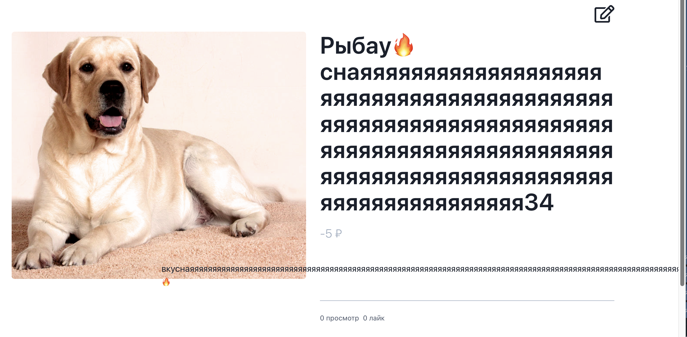

## Баг-репорт

# ID: BR01

### Название  
Успешное создание объявления с пустым обязательным полем.

### Описание  
Система позволяет создать объявление, оставив одно из обязательных полей пустым.

### Шаги для воспроизведения  
1. Нажать на кнопку **"Создать"**.
2. Оставить одно из полей обязательных для заполнения пустым.
3. Заполнить остальные поля валидными данными.
4. Нажать кнопку **"Сохранить"**.

### Ожидаемый результат  
Объявление не создается и не отображается в поиске.

### Фактический результат  
Объявление создается и отображается в поиске, несмотря на то, что одно обязательное поле осталось пустым.

### Статус  
Новый.

### Приоритет  
Medium.

### Примечание
Объявление не создается через веб-интерфейс, но создается через **Postman**.

### Вложения
[Postman](EXTRA/create_with_empty_field_response.json)

# ID: BR02  

### Название  
Создание объявления с невалидными данными.  

### Описание  
При создании объявления с невалидными значениями в полях **"Цена"** и **"Ссылка на изображение"**, система должна блокировать сохранение объявления и выводить соответствующие подсказки. Тем не менее, объявление сохраняется с некорректными данными.  

### Шаги для воспроизведения  
1. Нажать на кнопку **"Создать"**.  
2. Ввести в поле **"Цена"** любое отрицательное числовое значение.  
3. Добавить невалидную URL-ссылку на изображение.  
4. Заполнить остальные поля валидными данными.  
5. Нажать кнопку **"Сохранить"**.  
6. Повторить шаги 1-5, заменив числовое значение в шаге 2 на любое буквенное.  

### Ожидаемый результат  
Объявление не должно сохраняться, и должны появляться соответствующие ошибки:  
1. **"Цена"** не может быть отрицательной и может содержать только числа.  
2. Изображение по указанной ссылке недоступно.  

### Фактический результат  
- Объявление сохраняется и отображается при поиске.  
- Поле **"Цена"** корректно не принимает буквенные значения, но позволяет ввести отрицательное число.  
- Поле **"Ссылка на изображение"** принимает невалидные URL-ссылки без валидации.  

### Статус  
Новый.

### Приоритет  
Medium.
  

# ID: BR03  

### Название  
Создание объявления с слишком большой картинкой.

### Описание  
При создании объявления с добавлением URL-ссылки на изображение размером больше 1000x1000 система должна предотвратить его сохранение и вывести пользователю сообщение о недопустимом размере изображения. Тем не менее, объявление создается, но изображение не отображается.

### Шаги для воспроизведения  
1. Ввести в поле **"Название"**, **"Цена"**, **"Описание"** валидные значения.
2. Добавить URL-ссылку на изображение размером больше 1000x1000.  
3. Нажать кнопку **"Сохранить"**.  

### Ожидаемый результат  
Объявление не сохраняется, система выводит предупреждение о превышении допустимого размера изображения.  

### Фактический результат  
Объявление успешно создается, но изображение не отображается.  

### Статус  
Новый.

### Приоритет  
Medium.

# ID: BR04  

### Название  
Редактирование объявления с пустым обязательным полем.

### Описание  
При редактировании объявления и удалении значения из обязательного поля система должна предотвратить сохранение изменений и вывести пользователю сообщение об ошибке. Однако, объявление успешно сохраняется и остается доступным в поиске.  

### Предусловия  
Существующее объявление с заполненными полями.  

### Шаги для воспроизведения  
1. Нажать на кнопку **"Редактировать"** у существующего объявления.  
2. Оставить одно из обязательных полей пустым.  
3. Заполнить остальные поля валидными значениями.  
4. Нажать кнопку **"Сохранить"**.  

### Ожидаемый результат  
Система запрещает сохранение изменений и выводит сообщение о необходимости заполнения обязательного поля.  

### Фактический результат  
Объявление успешно сохраняется и отображается при поиске.  

### Статус  
Новый.

### Приоритет  
Medium.

# ID: BR05  

### Название  
Редактирование объявления с добавлением невалидных данных.

### Описание  
При редактировании объявления и вводе невалидных данных в полях **"Цена"** и **"Ссылка на изображение"** система должна предотвратить сохранение изменений и вывести пользователю соответствующие сообщения об ошибке. Однако, объявление успешно сохраняется и отображается в поиске.  

### Шаги для воспроизведения  
1. Ввести в поле **"Название"** любое значение.  
2. Ввести в поле **"Цена"** любое числовое значение ниже 0.  
3. Ввести в поле **"Описание"** любое значение.  
4. Добавить невалидную URL-ссылку на изображение.  
5. Нажать кнопку **"Сохранить"**.  
6. Повторить шаги 1-5, заменив числовое значение в шаге 2 на любое буквенное.  

### Ожидаемый результат  
Объявление не сохраняется, система выводит предупреждения о том, что:  
1. Цена не может быть отрицательной и может содержать только числа.  
2. Изображение по данной ссылке недоступно.  

### Фактический результат  
Объявление успешно редактируется и отображается в поиске, но не редиктируется при попытке ввода буквенного значения в поле **"Цена"**.

### Статус  
Новый.

### Приоритет  
Medium.

# ID: BR06  

### Название  
Успешное редактирование объявления с добавлением слишком большой картинки.

### Описание  
При редактировании объявления и добавлении URL-ссылки на изображение размером больше 1000x1000 система должна запретить сохранение и вывести соответствующее сообщение об ошибке. Тем не менее, объявление успешно сохраняется, а изображение не отображается.  

### Шаги для воспроизведения  
1. Ввести в поле **"Название"** любое значение.  
2. Ввести в поле **"Цена"** любое числовое значение, равное или больше 0.  
3. Ввести в поле **"Описание"** любое значение.  
4. Добавить URL-ссылку на изображение размером больше 1000x1000.  
5. Нажать кнопку **"Сохранить"**.  

### Ожидаемый результат  
Объявление не сохраняется, система выводит предупреждение о том, что размер изображения должен быть меньше 1000x1000.  

### Фактический результат  
Объявление успешно редактируется и отображается при поиске, изображение отсутствует.  

### Статус  
Новый.  

### Приоритет  
Medium.

# ID: BR07  

### Название  
Некорректная работа сортировки объявлений.

### Описание  
Функция поиска и сортировки объявлений по лайкам и убыванию не работает корректно. При выборе сортировки объявления не меняют порядок, но указанное количество объявлений отображается верно.    

### Шаги для воспроизведения  
1. Ввести в поисковую строку слово из названия отображаемых объявлений.  
2. Выбрать критерий сортировки **"по лайкам"**.  
3. Выбрать порядок сортировки **"по убыванию"**.  
4. Выбрать количество объявлений на странице: **10**.  
5. Прокрутить страницу и проверить порядок объявлений.  

### Ожидаемый результат  
Объявления сортируются по убыванию количества лайков, на странице отображается выбранное количество объявлений.  

### Фактический результат  
Объявления не сортируются, но на странице отображается выбранное количество объявлений.  

### Статус  
Новый.

### Приоритет  
High.

# ID: BR08  

### Название  
Нарушение верстки в поле "Описание" при длинных значениях.

### Описание  
При добавлении длинных значений в поле "Описание" (более 100 символов), верстка нарушается и символы выходят за пределы отведенной области, несмотря на корректное отображение данных в полях "Цена" и "Название", где в общей сетке объявлений они обрезаются с многоточием.

### Шаги для воспроизведения  
1. Создать или найти объявление с более чем 20 символами в полях **"Название"** и **"Цена"**, а также с более чем 100 символами в разделе **"Описание"**. Пользователь находится в разделе **"Объявления"**.  
2. Проверить обрезку цены и названия, наличие многоточия.  
3. Открыть карточку товара и проверить корректность отображения символов в поле "Описание".  

### Ожидаемый результат  
Символы в полях **"Цена"** и **"Название"** обрезаются с многоточием, а в поле **"Описание"** все символы отображаются корректно.

### Фактический результат  
Обрезка символов и многоточие присутствуют в полях **"Цена"** и **"Название"**, но в поле **"Описание"** символы выходят за границы, нарушая верстку. 

### Статус  
Новый.

### Приоритет  
High.

### Вложения
